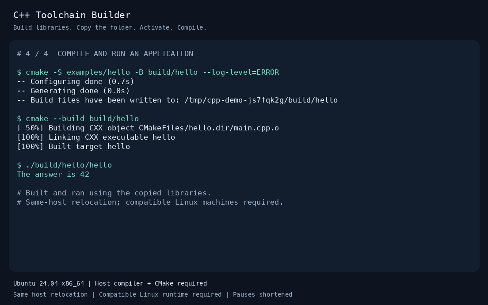

# Build, copy, activate, compile

The [README recording](media/workflow.gif) runs the small
[fmt/spdlog example](../examples/library.yaml) through a real build and then uses
the copied installation to compile and run [a C++ application](../examples/hello).



## What the recording shows

1. Build fmt 11.2.0 and spdlog 1.15.3 into an empty installation directory.
2. Copy that directory with `cp -a`, preserving its contents and file permissions.
3. Move the original installation out of the way, leave the Python builder's
   virtual environment, and activate the copy with `source shared/toolchain/activate`.
4. Configure a fresh CMake build, compile the application, and run it. The output
   is `The answer is 42`.

The capture was made on **Ubuntu 24.04 x86_64**, with host GCC **13.3.0** and
CMake **4.1.1**. The builder was already installed and the two pinned source
archives were already downloaded. Both libraries are actually compiled during
the recording; existing installed libraries and build directories are not reused.
All recorded commands run with networking disabled in a Linux network namespace.

The recorder checks that CMake found both packages in the copied directory,
that the original installation path is absent, and that the builder CLI is no
longer on `PATH` when the application is built.

**Compatibility:** this is a library bundle, so the receiving environment still
needs a compatible C++ compiler and CMake. Copying to another machine requires a
compatible CPU architecture, Linux runtime, compiler, and C++ ABI. This recording
tests a different directory on the same host; it does not establish support for
another distribution or validate the complete GCC/LLVM preset. See
[the validation record](validation.md) for the broader testing boundaries.

## Read or replay

- [Plain-text transcript](media/workflow.txt), including the actual commands and output.
- [Animated GIF](media/workflow.gif), with terminal inactivity shortened to at most
  2.5 seconds between updates and a longer hold on the final result.
- [Static final frame](media/workflow.png), for a view without animation.
- [Asciicast recording](media/workflow.cast), preserving the original event timing.

With asciinema installed, replay the recording from the repository root:

```bash
asciinema play docs/media/workflow.cast
```

The recording's header requests a 2.5-second idle limit. The GIF adds a title,
compatibility captions, and colors to the captured terminal output. These
presentation changes do not replace command output or fabricate build results.

## Make a fresh recording

This is an optional documentation task; recording dependencies are not needed to
build or use toolchains. It requires the quickstart prerequisites, a builder
installed in `.venv`, Pillow, a DejaVu Sans Mono font, and `unshare` with
unprivileged user/network namespaces enabled.

On Ubuntu, Pillow and the font are available as `python3-pil` and
`fonts-dejavu-core`. Prepare the cache and run the recorder from the repository root:

```bash
.venv/bin/toolchain fetch --config examples/library.yaml --locked
python3 scripts/record_demo.py
```

Use `--cmake /path/to/cmake`, `--venv /path/to/venv`, or `--font /path/to/font.ttf`
when those dependencies are elsewhere. `python3` above must be an interpreter
with Pillow available; the builder itself runs from the selected virtual environment.

The recorder copies the example and its two cached source archives into a new
temporary directory. It executes [demo.sh](../scripts/demo.sh) in a clean shell,
records real PTY output, and regenerates the four files under `docs/media/`.
It removes its temporary workspace on success and retains it on failure for
debugging. Existing SDKs and example builds in the checkout are left intact.
Run the shell script through the recorder so its relocation check stays inside
the disposable workspace.

If recording on a different platform or with different compiler/tool versions,
update this page to match the new capture. No recording is uploaded automatically.
