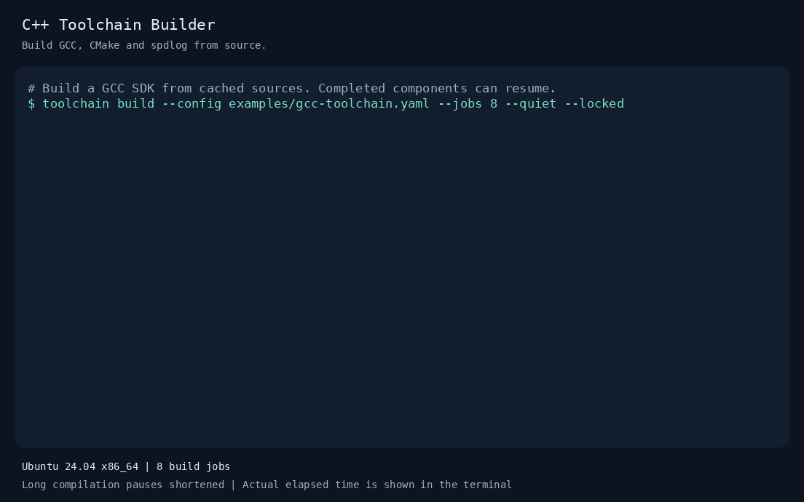
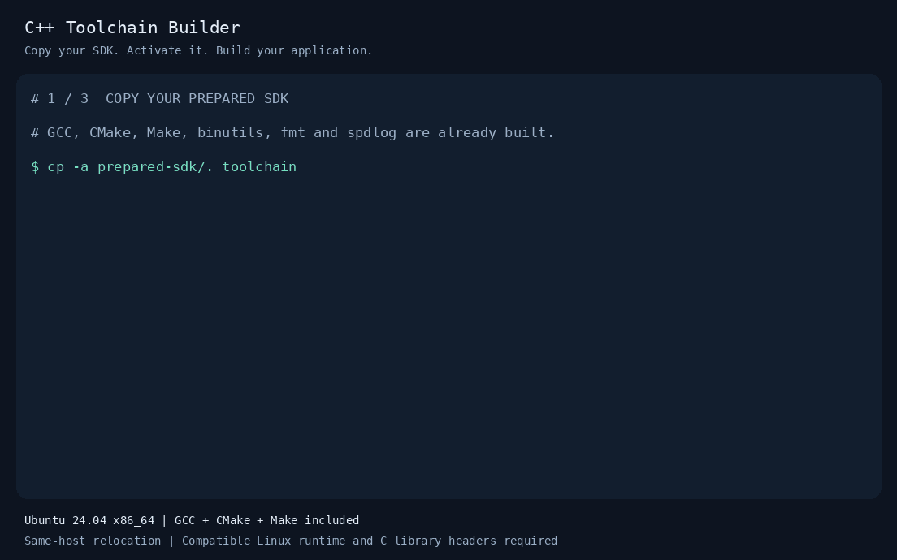

# Build an SDK, then use the copy

These recordings use the [six-component GCC SDK](gcc-toolchain.md): GCC 15.2.0,
CMake 4.1.1, Make 4.4.1, binutils 2.45, fmt 11.2.0, and spdlog 1.15.3.

## Build the compiler, tools, and libraries



[Text transcript](media/gcc-build.txt) · [Static final frame](media/gcc-build.png) ·
[Terminal recording](media/gcc-build.cast)

The source archives were cached before recording. Binutils was completed in the
preceding run; this capture shows the successful resumed build of GCC, Make,
CMake, fmt, and spdlog. GCC performs its three-stage bootstrap. The final terminal
line reports the run's measured elapsed time; playback limits long pauses to
2.5 seconds rather than making the viewer wait through compilation.

The recorded run took **55 minutes 21 seconds** with eight jobs. GCC accounted
for **49 minutes 34 seconds** and CMake for **5 minutes 24 seconds**. Binutils
took a further **62 seconds** in the preceding run. These measurements exclude
source downloads and are observations on one host. The build GIF plays for
**17.12 seconds**; the usage GIF plays for **26 seconds**.

## Copy, activate, compile, run



[Text transcript](media/gcc-use.txt) · [Static final frame](media/gcc-use.png) ·
[Terminal recording](media/gcc-use.cast)

The application uses both fmt and spdlog and prints `The answer is 42`.
`prepared-sdk/` refers to the installation produced by the preceding build.
Copying `prepared-sdk/.` copies its contents even when that name is a symlink.

The usage recorder checks that:

- The shell starts without GCC, CMake, Make, Python, or the builder on `PATH`.
- Activation selects GCC, CMake, Make, the assembler, and the linker from the copy.
- GCC resolves its compiler helpers inside the copy.
- CMake records the copied compiler, Make executable, fmt package, and spdlog package.
- The example compiles and runs successfully with networking disabled.

The original installation, `/usr/lib/gcc`, and `/usr/include/c++` are hidden in a
private mount namespace during the check. The host's files are unchanged outside
that namespace. The system C library development files remain available.

Both the isolated consumer and `toolchain inspect verify --smoke` passed using
the freshly built GCC 15.2.0. The compiler's stage-two/stage-three bootstrap
comparison also passed. These checks do not include GCC's complete upstream
test suite.

**Compatibility:** this records a move to another directory on one Ubuntu 24.04
x86_64 host. The receiving machine still needs a compatible Linux runtime,
ordinary shell utilities, zlib, and C library headers/startup objects
(`zlib1g` and `libc6-dev` on Ubuntu). This is not a glibc/sysroot bundle or proof
of portability to other distributions. The complete 37-component GCC/LLVM preset
remains a separate, unvalidated build.

## Replay or regenerate

With asciinema installed, replay either capture from the repository root:

```bash
asciinema play docs/media/gcc-build.cast
asciinema play docs/media/gcc-use.cast
```

The GIFs contain the captured output with colors and explanatory captions added.
The build recording replaces the checkout's absolute path with `$PROJECT` and
normalizes its introductory caption. Command output and the real timing values
are retained. The successful build was resumed after correcting a tar ownership
issue in the isolated recording environment; the recorder uses
`TAR_OPTIONS=--no-same-owner` for that environment.

To make fresh recordings, first follow the [SDK build prerequisites](gcc-toolchain.md).
Recording additionally requires Pillow, a monospace TrueType font, and Linux
`unshare` with user/mount/network namespaces enabled. On Ubuntu, the optional
rendering packages are `python3-pil` and `fonts-dejavu-core`.

Run these with a Python interpreter that has Pillow available; the builder runs
from the existing `.venv`:

```bash
# This can take a long time if the SDK has not been built yet.
python3 scripts/record_gcc_demo.py build --jobs 8

# Record a copy of the completed installation and check its consumer tools.
python3 scripts/record_gcc_demo.py use
```

The build command retains raw recordings incrementally under
`.toolchain-work/gcc-sdk-capture/`. It uses the existing SDK state, so a completed
build will show skipped components. Keep the build environment and paths the
same when resuming. `--host-tools /path/to/bin` can supply a local bootstrap tool
such as flex. `build --offline` additionally disables networking; use it only
after all top-level sources and GCC prerequisites are cached.

To render an existing successful build capture without compiling again:

```bash
python3 scripts/record_gcc_demo.py render-build .toolchain-work/gcc-sdk-capture/build-2.cast
```

Use the capture filename printed or created by your run. The usage recorder
copies the SDK into a disposable directory, runs the consumer checks there, and
removes its copy on success. It preserves the temporary directory on failure.
The original SDK is retained. No media or binaries are uploaded by the scripts.
